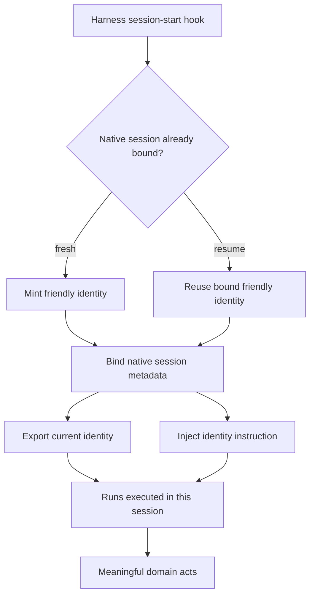
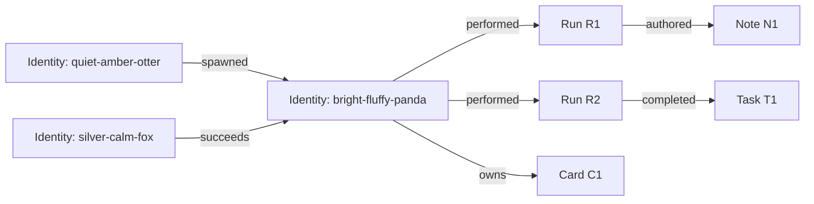

# RFC: Session identity and agent provenance

- **Status:** Parked exploration; no implementation decision
- **Captured:** 2026-08-17
- **Scope:** A prospective identity spool in Millhouse, harness start hooks, and composition by Kanban and `agent-run`
- **Follow-up strand:** [`99501` — Revisit session identity and agent provenance](strand://99501)
- **Conversation provenance:** Pi session `01a01133-4166-7e90-baaa-60cc2d0cf1eb`

## 1. Brief

Agents currently receive no canonical identity. When a Kanban operation requires
`--owner` or `--by`, an agent invents a name or uses its harness name. The board
therefore records values such as `claude` or `pi`, which identify neither a
particular conversation nor a durable source of work. `strand agent` records
runs and some run lineage, but does not give the running agent a general-purpose
identity other spools can consume.

The original brief described the failure this way:

> currently there's no 'identity' given to an agent; this leads to kanban tasks
> being completed by a name the agent made up or just their harness name. It also
> means there's no real provenance tracked via `strand agent`

A newly available seam changes the design space: Claude, Codex, Pi, and Cursor
can all be assumed to offer a session-start hook. A hook receives facts such as
native session ID, model, and effort/thinking level, and can bind environment
state or augment the initial system prompt before the agent acts. Harness details
were deliberately not verified in this exploration; the universal start-hook
capability is a design assumption.

The discussion began with stable actor identities spanning sessions, but exposed
ambiguity for interactive use. It then pivoted to a simpler working hypothesis:

> **An agent identity is one logical harness session.** A fresh session receives
> a new friendly identity; native resume retains it; each bounded invocation is
> a run beneath it.

The prospective identity facility should be its own spool, useful without
`agent-run`. `agent-run`, Kanban, notes, and other domains may compose over it.
This RFC captures the reasoning and unresolved questions; it is not an accepted
implementation proposal.

## 2. Design constraints established in discussion

1. **Only friendly IDs should appear in normal user-facing data.** A value such
   as `bright-fluffy-panda` may itself be canonical; a second UUID is not assumed
   necessary.
2. **The identity facility is a separate spool.** It must not be merely an
   `agent-run` feature, even if `agent-run` is its first deep integration.
3. **Identity is available before the first agent turn.** Hooks may bind it into
   the environment and initial prompt.
4. **A resumed native conversation remains one logical session.** Resume starts
   another run but not another identity.
5. **Fresh sessions are new identities.** Continuity across an unrecoverable or
   cross-harness fresh session is explicit succession, not inferred sameness.
6. **Meaningful provenance belongs in the strand graph.** Looking at an identity
   should reveal useful work it performed, without turning the graph into a trace
   of every command or file read.
7. **Identity means “who”; run means “which bounded attempt.”** Session metadata
   and run execution facts must not be collapsed.
8. **The design should fail loudly.** Missing, unknown, conflicting, or invalid
   identity bindings must not fall back to a harness name or agent-invented text.

## 3. Current surrounding systems

### 3.1 Kanban

The Kanban spool currently requires a caller-provided owner when claiming a card:

```text
strand kanban claim <card-id> --owner <text> --branch <branch>
```

It optionally accepts caller-provided attribution for notes:

```text
strand kanban note <target-id> "..." --by <text>
```

The stored `owner` attribute also determines whether a task projects as `doing`.
These values are free-form strings today. Kanban has no way to validate whether
an owner represents an actual agent, distinguish two simultaneous Claude
sessions, or recover the execution that authored a note.

### 3.2 Agent-run and delegation

The external `ct.spools.agent-run` engine models bounded runs. Existing relevant
facts include:

- every run has a run strand ID;
- parsers may capture `agent-run/session-id` from harness output;
- `agent-run/spawned-by` records parent-run provenance;
- the engine exports `MILLSTRAND_RUN_ID` to interactive launcher scripts;
- serving runs receive their run ID through an injected preamble;
- notes may carry `note/by` with an author run ID;
- resume creates a successor run while continuing a captured native session.

This is useful execution provenance, but it does not identify top-level
interactive sessions and does not provide a general actor reference for Kanban
or other spools.

## 4. Terms and model

### 4.1 Logical session / identity

One continuous harness conversation, assigned an immutable friendly ID such as:

```text
bright-fluffy-panda
```

A native resume remains the same logical session and therefore the same
identity. A fresh conversation is a new identity, even when it continues the
same card or role.

The identity record may retain:

- canonical friendly ID;
- harness and native session ID;
- model and effort/thinking level;
- start/end timestamps and liveness state;
- parent identity, when spawned by another agent;
- predecessor identity, when deliberately continuing work in a fresh session.

### 4.2 Run

One bounded execution attempt. A run has its own prompt/input, timestamps,
result, status, usage, logs, failure, and retry/supersession history. Several
runs may occur within one resumed logical session.

```text
bright-fluffy-panda                    identity / logical session
├── run R1                             initial invocation
├── run R2                             resumed invocation
└── run R3                             another resumed invocation
```

If native resume is unavailable:

```text
bright-fluffy-panda                    old identity / session S1
├── run R1
└── run R2

quiet-amber-otter                      new identity / fresh session S2
└── run R3
    succeeds ──> bright-fluffy-panda
```

### 4.3 Meaningful act

A durable domain event or responsibility worth querying later: owning a card,
authoring a durable note, completing a task, reviewing a change, or spawning
another identity. It does not mean every shell command, file read, or model turn.

## 5. Why the initial stable-actor model was rejected

The first model separated a durable actor from sessions and runs:

```text
stable actor 1 ──< sessions 1 ──< runs
       │
       └── may spawn other stable actors
```

It offered stable ownership across lost sessions, fresh sessions, harness
changes, and retries. For example, `quiet-amber-otter` could begin in Claude,
lose the native session after a machine restart, and explicitly continue in a
fresh Codex session without changing the Kanban owner.

That model has genuine value only when the system can make a meaningful claim
that several distinct conversations are the same responsible actor. Interactive
use makes that claim awkward:

- starting a harness may mean a new actor, returning actor, or disposable chat;
- a hook cannot infer whether a fresh session should adopt an old actor;
- concurrent sessions under one actor blur responsibility;
- human-guided terminal use makes authorship less clear;
- copied environment values can accidentally or deliberately impersonate an
  actor;
- closing a terminal does not indicate that a stable actor's responsibility has
  ended;
- stable actors require adoption, lifecycle, and concurrency policy unrelated to
  the concrete session boundary.

Potential remedies included explicit actor adoption, signed binding tokens,
single-live-session rules, and recording `autonomous`, `human-guided`, or
`human-authored` participation. Those remedies are possible, but they add a
substantial identity policy before a demonstrated need for cross-session actor
continuity.

The pivotal observation was:

> If every harness launch always mints a new stable identity, it is effectively
> just another session ID.

The discussion therefore chose the logical session itself as the simpler,
mechanically knowable identity boundary. Stable responsibility across sessions
can remain attached to work, with explicit owner succession.

## 6. Working design direction



A start hook would approximately:

1. receive harness, native session ID, model, and thinking level;
2. receive optional correlation facts such as parent identity and run ID;
3. ask the identity spool to start or resume a logical session;
4. atomically mint a unique friendly ID for a fresh session, or recover the
   existing binding for a resumed session;
5. export the current friendly ID to the process environment;
6. augment the initial prompt so the model knows its identity and must use it for
   identity-bearing operations;
7. bind an already-created run when the launch came from `agent-run`;
8. record parent/child identity provenance when the session was spawned.

Illustrative output—not a settled API:

```json
{
  "identity": "bright-fluffy-panda",
  "native_session_id": "harness-session-id",
  "resumed": false,
  "parent_identity": "quiet-amber-otter",
  "run_id": "run-abc12",
  "prompt": "You are agent bright-fluffy-panda. Use this identity for identity-bearing operations; never invent another identity."
}
```

Illustrative environment:

```text
MILLSTRAND_AGENT_ID=bright-fluffy-panda
MILLSTRAND_RUN_ID=run-abc12             # only when a run exists
```

The prompt is guidance, the environment is transport, and the graph binding is
the authority. Domain operations should validate identity references rather than
trust arbitrary text.

## 7. Friendly ID as canonical identity

The user-facing constraint is strong:

> i only want to see the friendly id on things i look at - there might not even
> be a real need for an unfriendly name depending on how it's generated

The simplest response is to make `bright-fluffy-panda` the canonical strand ID
or canonical identity key, not an alias for a UUID. That constrains the system:

- IDs must be unique in the chosen identity domain;
- IDs must be immutable and never reused, including after session end;
- generation and collision checking must be atomic;
- spelling must be CLI-safe, normalized, and resistant to confusing variants;
- the word-list/version should be recorded or otherwise governed;
- the vocabulary must provide enough combinations for the expected lifetime of
  the registry;
- rename should initially be forbidden, because copied attributes, logs, prompts,
  and external references otherwise require aliases or rewriting;
- structured output should return the same friendly canonical ID users see.

An internal opaque binding token may still be useful for hook authenticity, but
it would be a capability, not the identity humans or domain records observe.
The RFC does not require one.

## 8. Graph shape and provenance

The graph should retain direct, useful relations rather than require every query
to traverse only one hierarchy.



### 8.1 Run-level provenance by default

Concrete acts should normally edge from the exact run:

```text
run R1 ──authored──> note N1
run R2 ──completed──> task T1
run R3 ──reviewed──> change C1
```

This preserves prompt, model, time, result, logs, and retry context. Failed and
successful attempts do not blur together. Identity-level history can be derived
through the direct identity-to-run relation.

### 8.2 Identity-level relations where responsibility is durable

Some relations naturally belong directly to identity:

```text
identity ──owns────────> card
identity ──assigned-to─> task
identity ──spawned─────> child identity
identity ──succeeds────> predecessor identity
```

Acts outside `agent-run`, especially top-level interactive work, may only have an
identity. The design must not make agent-run a prerequisite for attribution.

### 8.3 Avoid an event-log graph

Do not edge every read, command, file touch, or model turn. Record durable acts
that aid ownership, handoff, audit, or archaeology. Each composing domain should
own the meaning of its relations; the identity spool should not absorb Kanban,
notes, reviews, or workflow semantics.

## 9. Spool boundaries

### 9.1 Identity/session spool owns

- friendly identity generation, uniqueness, and validation;
- the invariant `identity = logical harness session`;
- fresh-session registration and resume lookup;
- native session, harness, model, and thinking-level metadata;
- current-session lookup for hooks and local commands;
- session start/end state;
- generic identity lineage such as `spawned` and `succeeds`;
- hook-facing API/operations;
- environment and prompt-binding material.

It should not know what a run, Kanban card, note, review, or workflow is.

### 9.2 Agent-run composes over identity

- exports a pre-existing run correlation ID to the child harness;
- exposes the invoking identity when spawning a child;
- binds each run to the identity/session that executed it;
- adds exact run-to-run lineage with existing `agent-run/spawned-by`;
- causes identity-to-child-identity lineage to be recorded after the hook mints or
  resumes the child;
- verifies that resume recovered the identity expected for the predecessor's
  native session;
- retains run-specific prompts, attempts, usage, cost, logs, results, and
  supersession.

### 9.3 Kanban and notes compose over identity/run

Kanban should eventually replace unconstrained owner strings with validated
identity references. Board and card projections show only friendly IDs.

A likely attribution split is:

```text
card owner       = current logical-session identity
note actor       = logical-session identity
note by/run      = exact run, when one exists
```

The exact schema is unresolved. Edges are preferred for referential integrity
and reverse queries, but existing string attributes and projection ergonomics
must be considered deliberately.

### 9.4 Dependency direction

```text
identity/session spool  ←  agent-run  ←  delegation
          ↑                    ↑
        kanban              run-aware acts
          ↑
        notes / future domains
```

The arrows mean “composes over / depends on.” The identity spool remains useful
for top-level interactive harnesses that never pass through agent-run.

## 10. The headless correlation problem

Agent-run creates the run strand before launching the harness. The harness hook
creates or recovers the identity after process start. Therefore the binding is a
two-stage handshake:

```text
agent-run creates R1
        |
        | exports MILLSTRAND_RUN_ID=R1
        v
harness starts and invokes hook
        |
        | identity spool mints/resumes bright-fluffy-panda
        v
bright-fluffy-panda ──performed──> R1
```

The hook must also know enough parent context to record identity lineage:

```text
parent run R0
  ├── agent-run/spawned-by lineage ──> child run R1
  └── parent identity calm-red-kite ──spawned──> bright-fluffy-panda
```

A launch that exits before the hook binds identity leaves an identity-unbound
run. That must become a loud launch failure or a clearly queryable incomplete
state, never a successful anonymous run.

On native resume, agent-run should provide the identity expected from the
predecessor. The hook resolves the native-session binding and fails on mismatch;
it must not mint a replacement identity while claiming resume continuity.

## 11. Interactive-session behavior

The session-as-identity model removes most interactive ambiguity:

- fresh interactive launch → new friendly identity;
- native resume → same friendly identity;
- simultaneous fresh sessions → distinct identities;
- lost/unresumable session → new identity;
- deliberate continuation of old work → update ownership and add `succeeds`;
- casual sessions may create empty identities, but those can remain harmless
  historical records or be treated as provisional until their first meaningful
  act.

Human participation remains an unresolved provenance limitation. A model in an
interactive terminal may be autonomous, human-guided, or merely presenting a
command the human executes. Session identity says which agent conversation was
present; it does not prove sole authorship. A future domain may record
participation mode, but this should not block basic identity.

Session end should end the live binding, not erase the identity. The strand and
its relations remain durable for archaeology.

## 12. Ownership continuity under this model

The model deliberately rejects fictional cross-session sameness. If a fresh
session continues a Kanban card, ownership changes:

```text
before
  card C1 ──owned-by──> bright-fluffy-panda

after lost session and explicit handoff
  card C1 ──owned-by──> silver-calm-fox
  silver-calm-fox ──succeeds──> bright-fluffy-panda
```

History should retain prior ownership acts or transitions even if the card
projection shows only the current owner. This makes responsibility explicit:
shared work continuity belongs to the card and its handoff history, while agent
identity remains grounded in shared conversation context.

## 13. Candidate hook-facing lifecycle

Names are illustrative. A future implementation must discover the repo's live
operation conventions before choosing a CLI.

```text
identity session start
  --harness claude
  --native-session <id>
  --model <model>
  --thinking-level <level>
  [--parent-identity <friendly-id>]
  [--run-id <run-id>]

identity session resume
  --harness claude
  --native-session <id>
  [--expected-identity <friendly-id>]
  [--run-id <run-id>]

identity session current

identity session end
  --native-session <id>
```

The start/resume distinction may instead be one idempotent bind operation if the
hook cannot reliably classify native resume. Required semantics are more
important than command names:

- same native logical session resolves to the same identity;
- a fresh native session never silently adopts an existing identity;
- duplicate concurrent bindings are deterministic or rejected;
- conflicting expected identity fails loudly;
- every successful response returns the canonical friendly ID;
- replay after hook retry is idempotent.

## 14. Failure and trust semantics

A production design needs explicit behavior for:

- collision during friendly-name generation;
- start-hook replay;
- two processes presenting the same native session ID;
- resume binding missing after state loss;
- expected identity differing from recovered identity;
- run ID missing, unknown, already bound, or bound to another identity;
- parent identity missing or malformed;
- hook succeeds but environment/prompt augmentation fails;
- process exits before hook/session-end callbacks complete;
- session-end hook never arrives;
- identity spool or Weaver unavailable at session start.

The current design instinct is fail-loud for identity-bearing managed launches.
For unmanaged top-level interactive launches, offline behavior is an open policy
question: refusing startup gives complete provenance but harms availability;
allowing anonymous startup recreates the original problem. Quiet fallback to
`claude`, `pi`, or a random unregistered name is explicitly unacceptable.

Environment variables alone are not authority because they can be copied. At a
minimum, every domain operation validates that the friendly identity exists.
Stronger binding may use process/session correlation or an opaque hook-issued
capability while keeping the friendly ID as the only visible identity.

## 15. Design options still open

### 15.1 Canonical strand ID versus identity attribute

The friendly value could be the actual strand ID, if Millstrand supports the
required minting and namespace guarantees, or an immutable `identity/id`
attribute on an ordinary generated strand. The former maximizes legibility; the
latter may fit existing storage mechanics better. Either way, public projections
must show only the friendly identity.

### 15.2 Edges versus copied attributes

Edges provide referential integrity and reverse traversal. Attributes are easy to
project and already used by Kanban and agent-run. A hybrid may be appropriate,
but duplicated sources of truth must be avoided or storage-enforced.

### 15.3 Persist every session versus promote on meaningful use

Persisting at hook start gives complete session history and simple resume lookup,
but creates many empty identities. Provisional bindings promoted on first act
reduce clutter but complicate resume and crash recovery. No choice was made.

### 15.4 Ownership edge direction

Examples in the discussion used `identity ─owns→ card`, but existing graph and
query conventions may favor `card ─owned-by→ identity`. Direction should follow
query ergonomics and declared relation conventions, not the diagrams alone.

### 15.5 Succession semantics

`succeeds`, `continues`, or a handoff-specific relation could connect fresh
sessions. The relation must not imply that two sessions are one identity. It may
belong to the identity spool as generic lineage or to the work domain as a card
handoff.

## 16. Rejected or deferred ideas

- **Harness name as identity:** ambiguous across every concurrent session and not
  provenance.
- **Agent-chosen identity text:** unvalidated and inconsistent.
- **Hidden UUID plus friendly alias by default:** unnecessary unless friendly ID
  generation cannot meet uniqueness and immutability requirements.
- **Stable actor spanning arbitrary sessions:** deferred until a concrete need
  justifies adoption, concurrency, and lifecycle policy.
- **Identity implemented only inside agent-run:** rejects top-level interactive
  use and prevents independent composition by Kanban or future spools.
- **Every act attached only to identity:** loses exact attempt, model, prompt,
  failure, and retry evidence when a run exists.
- **Every event attached to identity:** turns the strand graph into a noisy event
  log.
- **Silent anonymous/offline fallback:** reproduces the problem under a different
  name.

## 17. Open questions

1. What is the uniqueness domain for friendly identities: workspace, Weaver,
   user machine, or a broader shared world?
2. Is the friendly identity the actual strand ID or an immutable attribute?
3. What word-list size and normalization rules make three-word names safe for
   permanent canonical use?
4. Must all hook-started sessions persist immediately, or only after a meaningful
   act?
5. Which generic relations belong to the identity spool: `spawned`, `succeeds`,
   `performed`, or only session bindings?
6. Should domains store identity attributes, identity edges, or both under an
   enforced projection?
7. Should `note/by` remain the exact run while a separate relation identifies the
   session identity?
8. How does Kanban preserve owner history while projecting one current owner?
9. How should a top-level interactive session declare that it is continuing work
   from a lost identity without pretending to be that identity?
10. What correlation/capability prevents copied environment variables from
    impersonating another live identity?
11. What happens when the identity Weaver is unavailable during an unmanaged
    interactive launch?
12. How are stale live-session records reconciled when session-end hooks do not
    run?
13. Can each harness reliably expose the native logical session ID early enough
    to distinguish fresh start from resume, or must binding be idempotent without
    that classification?
14. Does `agent-run` need to wait for hook acknowledgement before treating a run
    as running?
15. Should spawned agent identity lineage be recorded by the hook, agent-run, or
    an idempotent handshake involving both?

## 18. Suggested next-session sequence

1. Read this RFC and strand `99501`.
2. Inspect Millstrand relation/vocabulary conventions before fixing edge names or
   directions.
3. Inspect the hook implementations for Claude, Codex, Pi, and Cursor only when
   moving from design to protocol; this RFC assumes their start seam exists.
4. Decide canonical friendly-ID storage and uniqueness domain first.
5. Sketch the identity spool contract independently of agent-run.
6. Then map agent-run's existing `run-id`, `session-id`, resume, launcher env, and
   `spawned-by` seams onto it.
7. Sketch Kanban owner and note migration/projection without implementing it.
8. Write explicit lifecycle and failure tables before code, especially replay,
   resume mismatch, missing end hooks, and unbound runs.
9. Create implementation strands only after the spool boundary and public graph
   vocabulary are agreed.

## 19. Relevant sources

### Millhouse

- `spools/kanban/README.md`
- `spools/kanban/src/millhouse/spools/kanban.clj`
- `spools/kanban/kanban.api.md`
- `spools/kanban/kanban.cookbook.md`

### Agent harness spools

- `/Users/ct/dev/projects/agent-harness.spool/agent-run/README.md`
- `/Users/ct/dev/projects/agent-harness.spool/delegation/README.md`

The agent-run README is especially relevant for:

- harness and alias definitions;
- native session capture and resume;
- interactive launcher environment;
- `agent-run/spawned-by`;
- run lifecycle and lineage;
- note attribution;
- injected preambles.

## 20. Conversation anchors

These excerpts preserve the turns that most changed the design.

### Separate spool, not an agent-run feature

> This focusses on agent-run, but the id spool would be its own thing, then it's
> also valid for anything else building on identity.

### Friendly identity is the visible identity

> i only want to see the friendly id on things i look at - there might not even
> be a real need for an unfriendly name depending on how it's generated

### Provenance should enrich identity queries

> especially if we tracked more edges to an identity to help track what a given
> agent did

### Interactive agents challenge stable actors

> identity works well for spawned agents, but for interactive ones it gets more
> awkward

### The simplifying pivot

> and if we pivot back and say the session is the identity?

### Final composition question

> is it coupled to agent-run (i'm ok with that), or can it be a spool here that
> agent-run composes over?

The resulting parked answer is: make identity/session an independent spool here;
let agent-run compose over it and contribute run-level provenance.

## 21. Strand record

No implementation strands were created during the exploratory back-and-forth.
One parking strand was created while making this discussion durable:

- [`99501` — Revisit session identity and agent provenance](strand://99501)

The RFC is intentionally self-contained. The strand may accumulate later notes
and links, but it is not required to reconstruct the design intent.
