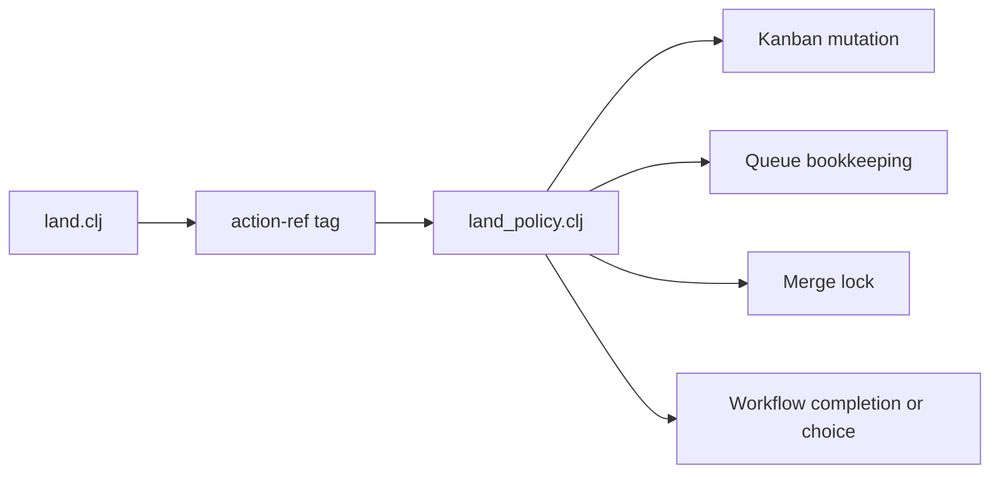
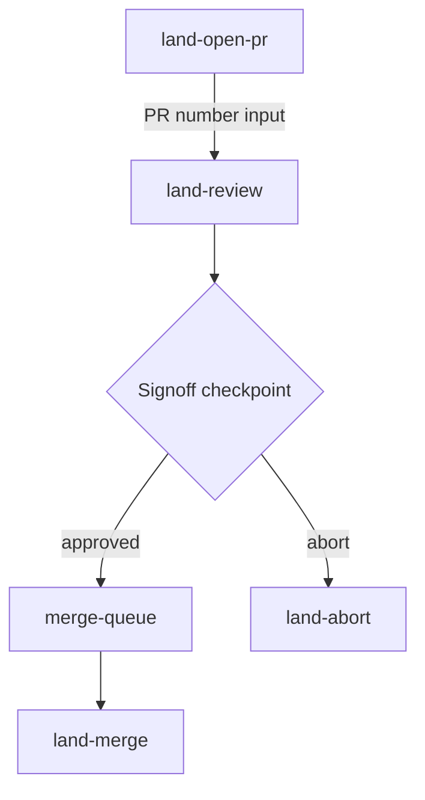

# RFC: Reassess `workflow/action-ref` through landing decomposition

- **Status:** Simplification implemented for review on 2026-09-11; live activation pending
- **Captured:** 2026-08-15
- **Scope:** `millhouse.spools.workflow`, `millhouse.spools.millstrand-workflows`, and Skein's local landing workflows/policy
- **Follow-up strand:** [`wef3s` — Revisit action-ref and landing decomposition](strand://wef3s)
- **Conversation provenance:** Pi session `01a003e2-b9e2-7048-b71b-4472a2afa90a`

## 0. Agreed direction — 2026-09-11

This section records the decisions from revisiting the RFC with the user. It
supersedes conflicting proposals in sections 1–20, which preserve the original
August exploration. The replacement workflow is implemented in the
`codex/simplify-land` Skein worktree and is undergoing final validation.

Inspection confirmed that Skein still uses the overloaded `land` operation and
action-ref dispatch. Its files have moved to
`../skein-src/.millstrand/me/workflows/land.clj` and `land_policy.clj`. Millhouse's
workflow source still projects action refs but no longer authors the assignments
described in the historical inventory below.

### Ordinary bookkeeping belongs in workflow gates

Record the PR through a checkpoint and express card movement, abort bookkeeping,
and terminal cleanup as explicit, short code gates. A card may briefly lag the
workflow while its update is visibly pending. On failure, stop at that gate and
make the unfinished work available for deliberate retry.

Do not add custom compensated transitions merely to make card and workflow state
appear to change together. In particular, an abort decision remains an abort if
later bookkeeping fails. The failed gate is the pending-work record; a separate
reconciliation mechanism is unnecessary. Side-effecting helpers must tolerate a
retry after their write succeeded but gate completion failed.

This also addresses weaknesses found in the current implementation: its abort
handler can compensate the card after routing has already committed, and terminal
completion closes the workflow step before releasing its lock and queue entry.
The current implementation is therefore not a failure-semantics baseline to copy
uncritically.

### Sign-off authorizes the queued landing

Coordinator sign-off joins the queue and authorizes the run to merge automatically
when its turn arrives. There is no separate `merge-queue approve` ceremony or
mandatory second sign-off after a clean rebase.

That authority also covers repairing conflicts or failed checks, obtaining focused
review where the changes warrant it, and validating the final HEAD. Agent judgment
remains intact: if a rebase substantially changes the work, the agent may explicitly
abort and consult the user instead of continuing to merge.

### Validate before merging and release before housekeeping

The protected sequence is:

1. Reach the queue head and acquire the merge lock.
2. Fetch main; rebase onto it and push if the branch is behind.
3. Validate the final branch HEAD. Reuse the existing successful result only if
   HEAD has not changed.
4. Merge the PR.
5. Fast-forward canonical main.
6. Release the merge lock and close the queue reservation.

Holding the merge turn through these steps prevents another cooperating landing
from advancing main between the freshness check and merge. Validation covers the
exact branch HEAD incorporating current main. Do not rerun quality on canonical
main after merging the already-validated tree.

Worktree removal, card completion, and resource tidying follow lock release. A
failure in that housekeeping leaves its own run unfinished without blocking the
next landing.

### Strict FIFO survives failures and timeouts

A run that fails rebase, validation, or another protected step keeps its queue
position and any acquired merge lock while it is repaired. Retry in place. Do not
automatically withdraw it or requeue it at the back: that risks starving a PR.

Only successful completion of the protected sequence or explicit withdrawal
advances the queue. Await timeouts preserve reservations. Queue mutation and lock
acquisition remain serialized. Deterministic active ordering is required; reuse
of a sequence number after the queue empties is not itself a FIFO failure.

### Explicit withdrawal is available to every agent

An explicit withdrawal names the queue entry and records a reason. Any agent may
abort another agent's land run; agents are trusted to exercise that authority
appropriately. Do not add owner-only restrictions, mandatory human approval, or
automatic eviction based on elapsed time.

Stop the withdrawn run's merge work before releasing its reservation and lock.
It must not later resume into merging after the next run takes over. Keep status
evidence sufficient for an agent to make this decision: queue position, lock
holder, workflow frontier, and timestamps.

### Implementation defaults and remaining work

- Keep one run ID across continuations and keep queue coordination Skein-local.
- Remove landing's dependence on action refs. Leave generic engine support alone;
  neither a public action-ref removal nor a new persisted step-ref is required.
- Use workflow titles, checkpoints, and gate status for progress reporting.
- Keep waiting separate from short queue mutations; do not occupy a bounded code
  executor worker with a long queue wait.
- Resolve the exact workflow/module and command layout during implementation.
  The overloaded `land complete` dispatch and special approval operation should
  disappear; the shared queue remains the custom coordination concern.
- Before replacing live definitions, inspect active runs and their persisted
  requests. This decision record does not migrate or restart any running weaver.
- Verify concurrent admission and acquisition, retained FIFO on failure/timeout,
  safe explicit withdrawal, repeatable side effects, and release before
  housekeeping. Follow the repositories' required quality checks.

### Review belongs before landing

Millstrand's configured Devflow cards route finishes after an approved proposal lands and its implementation cards are reviewed. Ralph or another development workflow implements those cards afterward. Proposal and card review therefore do not replace final code review.

Keep the full change-review roster in one repository-owned `review` workflow shared by story, fix, and Ralph. It owns review, findings resolution, and validation, and finishes with reviewed work. Landing accepts that work as an existing draft or ready PR, or as a branch needing a PR. It reuses completed review, including the review of a proposal being landed before implementation. It does not force PR preparation or an unconditional review roster onto every merge.

A broad user instruction to “land it” can authorize an agent to complete missing implementation and review through the existing development process before entering land. The workflow's own instructions describe these responsibilities; there is no separate landing guide.

### Implementation and activation record

The replacement lives in Skein's `me.workflows.land`, `review`, `card-actions`, and
`merge-queue`. PR recording and sign-off use ordinary checkpoints; short code
gates own card changes. Queue executors admit and release turns without occupying
a worker while waiting. The old `land` operation and its action-ref dispatch are
removed. The workflow's own instructions describe driving and repairing a run.

Millhouse adds `millhouse.spools.executors.shell/quiesce-run!`. It serializes
withdrawal with process launch, freezes future shell gates, and waits for owned
process cancellation before the queue can release a turn. Uncertain cancellation
retains the custody fact and reservation for explicit reconciliation. A merge
command that has already started is also a reconciliation case: stopping its
local client cannot undo a request GitHub may have accepted. Failed withdrawal
leaves the original turn held; deliberately resume its frozen gates after repair.

The workspace smoke test successfully loaded the complete replacement config in
a disposable world. Before activation, inspection found 18 legacy active land
roots and no active merge queue entries or merge locks. These records are not
retired merely because they are old. Their persisted instructions remain evidence
for explicit reconciliation; the implementation does not replay or migrate them.

The new shell API requires a workflow dependency update and weaver replacement.
The proposed dependency and workflow definitions have not been activated in the shared weaver. Account for active runs before replacing their live basis.

## 1. Brief

This RFC preserves a design discussion that began with a simple question:

> what is `workflow/action-ref` for in workflows?

The discussion progressively narrowed from hypothetical uses to actual behavior. The central concern, in the user's words, became:

> I just feel this action ref is not obvious and you are making it more confusing by expanding on the world of possibilities.

Inspection showed that `workflow/action-ref` has little operational use in the Millhouse workflow spool or `millstrand-workflows`. Skein does have one concrete consumer: its local landing policy branches on ready steps' `:action-ref`. Re-expressing that landing policy as explicit workflows and narrowly named transaction/queue operations made the action-ref dispatch unnecessary and exposed that the existing `land` operation owns several unrelated concerns.

The resulting hypothesis is deliberately limited:

> `workflow/action-ref` has no demonstrated necessary value in the landing system, and most other observed uses are redundant descriptive metadata. It may still be useful if a concrete generic consumer is designed, but hypothetical future consumers are not sufficient justification for architectural dependence today.

This is not yet a removal proposal. It is a durable account of the evidence, the alternative design explored, the safety properties that must survive, and the questions a future session must resolve.

## 2. Executive summary

### Current facts

1. `workflow/action-ref` is a caller-authored strand attribute.
2. The workflow engine stores it and projects it as `:action-ref` in ready-step views.
3. The engine does not use it for graph construction, readiness, routing, executor selection, completion, or override resolution.
4. There is no built-in action binding or third-party override API.
5. `spools/workflow` authors it extensively but does not dispatch on it.
6. Skein's `land_policy.clj` does dispatch on three action refs and uses action refs as status labels.
7. That dispatch can be replaced by explicit workflow boundaries and focused operations without weakening the conceptual model.
8. The original landing implementation nevertheless contains important concurrency, compensation, liveness, and recovery behavior that a clearer decomposition must retain.

### Design direction explored

```text
land-open-pr
    |
    | compensated PR/card transition
    v
land-review
    |
    | checkpoint: approved / abort
    |
    +-- approved --> merge-queue join/await/approve --> land-merge
    |
    `-- abort ----> compensated abort transition ----> land-abort
```

The generic workflow surface remains responsible for ordinary progression. Custom operations remain only where multiple state owners or independent workflow runs require coordination.

## 3. Terminology

| Term | Meaning in this RFC |
| --- | --- |
| **Step ref / step keyword** | The authored `:id`, such as `:push-draft-pr`, used while compiling dependencies. |
| **Materialized strand ID** | The generated persistent ID returned in ready responses. |
| **Action ref** | The optional `workflow/action-ref` string attribute, such as `"land.pr.open"`. |
| **Instruction** | `workflow/instruction`, free-form guidance shown to the driver. |
| **Gate waiter** | The owner such as `:shell`, `:code`, or `:subagent` that selects gate executor behavior. |
| **Compensated transition** | Multiple writes that cannot share one storage transaction but have explicit rollback/reconciliation behavior. |
| **Merge queue** | The repository-wide FIFO of independent land runs waiting to acquire the singleton merge lock. |

## 4. What `workflow/action-ref` actually does

The workflow query projection contains the complete engine behavior of interest:

```clojure
(attr step :workflow/action-ref)
(assoc :action-ref (attr step :workflow/action-ref))
```

Source: `spools/workflow/src/millhouse/spools/workflow/internal/query.clj`.

The attribute is also declared in the workflow vocabulary in:

- `spools/workflow/src/millhouse/spools/workflow.clj`

It does **not** affect:

- dependency edges;
- conditional or loop expansion;
- ready-frontier calculation;
- gate executor selection;
- checkpoint routing;
- step completion;
- defer selection;
- workflow discovery;
- action override resolution.

The engine's role is therefore:

```text
workflow definition
  -> compile attribute
  -> persist attribute on strand
  -> project attribute into ready JSON
```

It is transport, not semantics.

## 5. Why it was originally introduced

The historical design record is:

- `../skein-src/devflow/archive/26-07-02__workflow-engine-review/PLAN.md`

Its motivating complaint was that Beads hardcoded GitHub CI. Adding GitLab required extending Beads itself. The intended separation was:

```text
semantic action                         concrete binding
─────────────────────────────────────   ─────────────────────────────────────
pr.ci.wait                              gh pr checks --watch --fail-fast
pr.ci.wait                              glab ci status --live
```

The plan explicitly stated:

- the workflow engine never executes tools;
- agents interpret ready-step data;
- action refs provide stable semantic names;
- definition-time pure-data bindings map those names to concrete attributes;
- a Weaver/socket action registry was a deferred second layer;
- no protocol or generic action registry was added.

The resulting cookbook pattern is ordinary userland Clojure:

```clojure
(def github-bindings
  {:pr.ci.wait {:instruction "gh pr checks --watch --fail-fast"
                :skills "ci-watch"}})

(def gitlab-bindings
  (merge-with merge github-bindings
              {:pr.ci.wait {:instruction "glab ci status --live"}}))
```

An author-written helper performs the lookup and stamps attributes. Merely adding `workflow/action-ref` does not enable rebinding.

## 6. Action ref is not an override capability

A key correction from the discussion is:

> the presence of `workflow/action-ref` does not bless or enable third-party overrides.

There is no API equivalent to:

```clojure
(workflow/override-actions third-party-definition
  {"pr.ci.wait" {"workflow/instruction" "glab ci status --live"}})
```

An author can expose a binding function keyed by action ref, but can expose the same mechanism keyed by step ref:

```clojure
;; Semantic action key
(get action-bindings :pr.ci.wait)

;; Workflow-local structural key
(get step-overrides :ci-wait)
```

Neither key grants authority. The customization seam comes from the author's API.

### The genuine distinction

```text
workflow + step ref
  = address one structural occurrence

action ref
  = optionally group occurrences under one semantic label
```

That distinction only earns its cost when a real consumer needs semantic grouping independent of workflow topology.

## 7. Why step identity became relevant

The authored step ref appears in definition/description views, but it is used as a batch-local graph ref during materialization. Ready JSON contains the generated strand ID, not the authored step keyword.

Conceptually:

```clojure
;; Definition/describe
{:id :publish-kondo-export
 :title "Publish the export"}

;; Ready/materialized view
{:id "generated-strand-id"
 :title "Publish the export"
 :action-ref "millstrand-workflows.publish.kondo-export"}
```

This means action ref sometimes acts as a substitute for a missing persisted step identity. If the desired information is simply “which authored node is this?”, a direct attribute such as `workflow/step-ref` would be more honest:

```clojure
{:step-ref "publish-kondo-export"}
```

Whether step refs should be persisted/projected is an open question, not a decision made here.

## 8. Evidence from `millstrand-workflows`

At the time of inspection, `spools/workflow/src` contained 38 `workflow/action-ref` assignments across five source files.

Observed behavior:

- workflows pair action refs with extensive `workflow/instruction` values;
- the instructions and gate request attributes drive actual work;
- no code in that spool dispatches, branches, binds providers, or enforces policy by action ref;
- one test asserts that an action ref was authored;
- most values mirror the surrounding workflow and step name.

Example:

```text
step ref:     :publish-kondo-export
action ref:  millstrand-workflows.publish.kondo-export
instruction: detailed producer export procedure
```

One stronger semantic example exists in Skein's story workflows: structurally different steps use `story.finish`. That demonstrates possible semantic grouping, but no observed consumer currently acts on that group.

## 9. Skein's concrete action-ref consumer

The concrete use is in:

- `../skein-src/.millstrand/ct/workflows/land.clj`
- `../skein-src/.millstrand/ct/workflows/land_policy.clj`

The workflow definitions stamp values including:

```text
land.pr.open
land.cleanup
land.abort.record
```

The policy operation reads the ready frontier and dispatches roughly as follows:

```clojure
(cond
  (some #(= "land.pr.open" (:action-ref %)) ready)
  ;; require/store PR number, move card, complete step

  (some #(contains? #{"land.cleanup" "land.abort.record"}
                     (:action-ref %))
        ready)
  ;; release lock and close queue bookkeeping as merged/aborted

  :else
  ;; reject this use of land complete
  )
```

It also reports liveness using:

```clojure
:stage (or (:action-ref step) (:checkpoint step))
```

This is a real runtime consumer. However, it is a private protocol between two landing-specific files, not a reusable generic action system.



## 10. The clarity problem

The original `land` operation combines two different surfaces:

```text
workflow land                         custom op land
──────────────────────────────────    ──────────────────────────────────
workflow progression                  merge queue
review and machine gates              merge lock
merge and abort continuations         kanban transitions
                                      special completion
                                      special sign-off choice
                                      action-ref dispatch
                                      forensic lock recovery
```

The user summarized the concern as:

> having it all baked into land seems overloaded to me

The issue is not terseness by itself. The issue is that `strand land complete` means different cross-domain transactions depending on a hidden tag. A reader must inspect both files and mentally reconstruct the behavior.

## 11. Alternative architecture explored

A temporary, non-production draft was written under `/tmp/skein-land-kiss/` during the discussion. Because `/tmp` is not durable, its essential design is reproduced here.

### Workflow decomposition



#### `land-open-pr`

```text
Push/open draft PR          ordinary step
        |
        v
Record exact PR number      checkpoint input
```

#### `land-review`

```text
Move card to review         compensated transition
Run branch quality          :shell gate
Reviewer fan-out            :subagent gates
Synthesize review           :subagent gate
Resolve findings            ordinary step
Run final branch quality    :shell gate
Sign off                    checkpoint
```

#### `land-merge`

```text
Merge PR                    :shell gate
Fast-forward canonical main :shell gate
Run canonical quality       :shell gate
Remove branch/worktree      :shell gate
Tidy owned resources        ordinary step
Finish optional card        :code gate
Release lock/close queue    :code gate
```

#### `land-abort`

```text
Move card back and route    compensated transition
Record abort                ordinary step
Leave branch/worktree       unchanged by design
```

### Focused merge-queue operation

The suggested public shape separates the durable queue mutation from repeatable waiting:

```text
strand merge-queue join <land-run-id>
  -> returns queue-entry-id
  -> returns instruction: strand merge-queue await <queue-entry-id>

strand merge-queue await <queue-entry-id>
strand merge-queue approve <queue-entry-id> --subject "..." --body "..."
strand merge-queue break <queue-entry-id> --reason "..."
```

The subject is accurately named: it owns queue and lock coordination across independent runs. It does not complete arbitrary workflow steps.

### Explicit transaction operations

Ordinary work should use generic workflow verbs, but two boundaries coordinate state owned by different systems:

```text
strand land-transition record-open-pr RUN --pr-number 42
strand land-transition abort RUN --reason "..." [--queue-entry-id ENTRY]
```

`record-open-pr` performs:

```text
move card to review
  -> route PR-number checkpoint to land-review
  -> if routing fails, compensate card move
```

`merge-queue approve` performs under the acquisition guard:

```text
prove queue entry is head
  -> acquire singleton merge lock
  -> choose approved and route to land-merge
  -> if routing fails, release newly created lock
```

This is guarded and compensated, not a literal single database transaction.

## 12. Why the queue remains a custom operation

The generic workflow surface already provides:

- `workflow ready` for the complete frontier;
- `workflow await` for waiting through healthy executor-owned gates;
- `workflow complete` for ordinary step completion and context updates;
- `workflow choose` for checkpoint input and continuation routing;
- `:shell` gates for subprocess requests;
- `:code` gates for trusted Clojure functions;
- `call` and `defer` for workflow composition.

The merge queue is different: it coordinates several independent workflow runs against one repository-wide FIFO and singleton lock. A long-blocking code gate would occupy a bounded code-executor worker. A workflow-local checkpoint cannot allocate or wait on a global queue by itself.

Therefore a focused `merge-queue` operation remains justified.

Separating `join` and `await` clarifies durability:

```text
join  = mutate once; reserve position
await = read/block repeatedly; timeout preserves position
```

## 13. Original versus draft

At capture time:

| Version | Approximate lines | Character |
| --- | ---: | --- |
| Existing `land.clj` + `land_policy.clj` | 1,461 | Proven and defensive, but behavior is partly hidden behind the overloaded op. |
| Temporary draft's workflows + actions + queue | 662 | Clearer decomposition, but illustrative and not production-hardened. |

The draft did not actually become larger. It removed policy machinery and separated responsibilities. However, line count is supporting evidence only; correctness matters more.

### What the draft improves

- workflow files state the process directly;
- shell, code, subagent, and agent-owned work are visibly distinct;
- queue commands have one coherent subject;
- join and await have separate semantics;
- transaction boundaries have explicit names;
- no behavior depends on action-ref dispatch;
- the generic workflow CLI remains the ordinary driving surface.

### What the original still does better

- established concurrency handling;
- strict lock ownership checks;
- durable queue ordering;
- rich liveness evidence for blocked runs;
- idempotent repeated requests;
- stale-lock and queue-head recovery;
- carefully staged compensation;
- existing test coverage.

The intended production direction, if pursued, is therefore:

```text
Draft's explicit architecture
            +
Original's failure semantics
```

## 14. Safety findings from self-review

The temporary draft must not be copied into production without resolving these findings.

### 14.1 Abort after routing is not roll-backable

The draft approximately performs:

```text
move card to rework
route workflow to land-abort
close queue entry
```

If queue cleanup fails after routing commits, moving the card back to review is not valid compensation: the workflow is already in the abort continuation.

The implementation must distinguish:

```text
before workflow route
  -> card compensation is possible

after workflow route
  -> preserve abort state and expose reconciliation work
```

### 14.2 Queue sequence must remain globally monotonic

The illustrative draft initially calculated the next sequence from active entries. That can reuse sequence numbers after the queue empties. Production should preserve the original historical monotonic allocation across all queue entries.

### 14.3 “Atomic” is the wrong claim

Lock creation and workflow routing are separate storage mutations. Holding a cross-process guard and compensating on failure is a saga-like transition, not atomic commit across stores. Contracts and documentation must say **guarded and compensated**.

### 14.4 Restore liveness and forensic evidence

The original queue reports:

- entries ahead;
- current run stage;
- lock holder;
- update timestamps;
- missing run roots.

The focused queue operation should retain this operator evidence without depending on action refs. Checkpoint names, titles, run state, and timestamps can provide the report.

### 14.5 Separate module responsibilities

A production layout should likely be:

```text
land_workflows.clj
land_transitions.clj
merge_queue.clj
```

Do not mix generic action helpers, CLI operation declaration, and queue dependencies merely to reduce file count.

## 15. Assessment of `workflow/action-ref`

### What this exploration demonstrates

For the landing system, every concrete responsibility can be expressed more directly:

```text
Workflow structure        -> explicit named workflows
Execution                 -> shell/code/subagent gates
Branching                 -> checkpoints and continuations
Shared coordination       -> merge-queue operation
Cross-system transitions  -> explicitly named compensated operations
Reporting                 -> checkpoint names, titles, queue/run state
```

None requires action ref.

The original action refs act as an indirect switch:

```clojure
(case (:action-ref ready-step)
  "land.pr.open" ...
  "land.cleanup" ...
  "land.abort.record" ...)
```

Replacing that switch with explicit workflow and operation boundaries improves clarity.

### What this exploration does not demonstrate

It does not prove action refs can never be useful. A future concrete consumer might need:

- stable semantic grouping across workflows;
- provider binding by capability;
- analytics independent of local graph layout;
- policy explicitly published against a semantic action contract.

But those consumers need an actual API, validation, uniqueness/scoping rules, and compatibility discipline. Potential alone should not make action refs architectural glue.

### Current working conclusion

> `workflow/action-ref` has no necessary value in Skein's landing system. In the other inspected workflows it is mostly redundant descriptive metadata. Unless a concrete cross-workflow consumer is introduced, it should not be treated as part of workflow correctness.

## 16. Options for a future decision

### Option A — Keep action refs as optional metadata

- retain vocabulary and ready projection;
- remove all correctness dependencies on it;
- document it as optional semantic annotation;
- avoid promising override behavior.

### Option B — Persist authored step refs instead

- add a direct `workflow/step-ref` engine-owned attribute;
- project it into ready responses;
- use it where consumers need authored structural identity;
- reserve action refs only for genuine semantic grouping.

### Option C — Build a real semantic action contract

Only justified by a concrete consumer. It would need decisions on:

- registration and ownership;
- scoping and uniqueness;
- allowed bindable attributes;
- unmatched and duplicate refs;
- precedence between action and exact-step bindings;
- discovery and JSON/socket representation;
- versioning and compatibility.

### Option D — Remove action ref entirely

Potentially simplest, but premature until repository-wide consumers and published compatibility expectations are audited.

## 17. Open questions

1. Should `workflow/action-ref` remain in the public vocabulary as optional metadata?
2. Should authored step refs be persisted and projected in ready views?
3. Are any external consumers—not present in the inspected repositories—using action refs?
4. Should the landing lifecycle retain one run ID across all continuations, as the draft assumes?
5. Is `land-transition` the right name, or should PR and abort transitions have separate operations?
6. Should merge approval belong to `merge-queue approve`, or a separately named sign-off operation?
7. What exact reconciliation record should be written when abort routing succeeds but queue cleanup fails?
8. How should liveness reports identify stages without action refs?
9. Which original landing tests encode essential behavior versus implementation coupling?
10. Is the merge queue reusable enough to become a shared spool, or should it remain Skein-local?

## 18. Suggested next-session sequence

1. Read this RFC and strand `wef3s`.
2. Re-read the original files in full:
   - `../skein-src/.millstrand/ct/workflows/land.clj`
   - `../skein-src/.millstrand/ct/workflows/land_policy.clj`
3. Inspect the live runbooks rather than assuming command surfaces:
   - `strand help workflow`
   - `strand help await`
   - `strand workflow executors`
4. Inventory external action-ref consumers before changing vocabulary.
5. Decide the public workflow/operation decomposition before coding.
6. Port failure semantics deliberately, beginning with queue ordering, lock ownership, and post-route reconciliation.
7. Write focused tests only once the public shape is agreed.

## 19. Relevant sources

### Millhouse

- `spools/workflow/src/millhouse/spools/workflow.clj`
- `spools/workflow/src/millhouse/spools/workflow/internal/query.clj`
- `spools/workflow/src/millhouse/spools/workflow/internal/routing.clj`
- `spools/workflow/workflow.cookbook.md`
- `spools/workflow/test/millhouse/spools/workflow_test.clj`
- `spools/workflow/README.md`
- `spools/workflow/src/millhouse/spools/`

### Skein

- `../skein-src/devflow/archive/26-07-02__workflow-engine-review/PLAN.md`
- `../skein-src/.millstrand/ct/workflows/land.clj`
- `../skein-src/.millstrand/ct/workflows/land_policy.clj`
- `../skein-src/.millstrand/ct/workflows/story.clj`
- `../skein-src/.millstrand/ct/workflows/fix.clj`
- `../skein-src/.millstrand/ct/workflows/explore.clj`
- `../skein-src/docs/reference.md`

## 20. Strand record

No implementation strands were created during the exploratory discussion. The temporary code was intentionally written under `/tmp` for reading only and was not tested.

One parking strand was created while capturing this RFC:

- [`wef3s` — Revisit action-ref and landing decomposition](strand://wef3s)

The RFC is intentionally self-contained; the strand may accumulate notes later but is not required to recover the design context.
