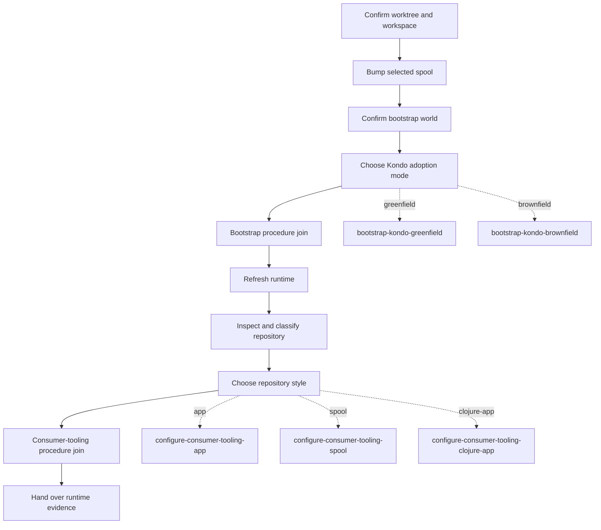

# Workflow gates, dry-run descriptions, and visualization RFC

**Document ID:** `RFC-Wgd-001`  
**Status:** Parked discussion capture  
**Date:** 2026-08-14  
**Decision status:** No implementation decision  
**Tracking strand:** [`fuqa9` — Explore workflow describe visualization](strand://fuqa9)

> **Purpose.** Preserve the precise questions, established behavior, and a
> possible next increment from the workflow exploration. This RFC is sufficient
> to resume the work without access to the original agent conversation. It is
> not a change proposal approved for implementation.

## 1. Brief

The discussion began with a practical question: **why does a workflow gate have
an instruction, and is it shown before or after the gate runs?** It broadened
into the agent-facing lifecycle:

1. What does a coordinator receive after `workflow next` reaches a gate?
2. How does it wait for a gate?
3. What reads the whole workflow rather than only its ready items?
4. Is `workflow/describe` a no-write dry-run?
5. Can the dry-run result become a Mermaid diagram?

The desired outcome is a coherent explanation—and perhaps later a product
surface—for agents to distinguish:

- ordinary work they may advance;
- externally owned gate work they must not advance implicitly;
- the declared definition; and
- a parameter-resolved, non-materialized plan.

## 2. Terms and current surfaces

| Term | Current surface | Meaning |
| --- | --- | --- |
| **Definition** | `strand workflow show <name>` | The registered, authored shape: params, declared entries, gates, checkpoints, calls, defers, and routes. It is topology-lazy. |
| **Description / dry-run** | `(workflow/describe workflow params)` | A pure, parameter-resolved projection of the graph that would pour. It expands calls and loops and applies conditions, but creates no run or strands. |
| **Ready frontier** | `strand workflow ready <run-id>` and every mutation response | The currently actionable items in an existing run. It is not the remaining graph. |
| **Gate** | A ready item with `:gate` | An ordinary step whose completion belongs to an external actor or executor. It is explicitly selected and attributed when closed. |
| **Instruction** | `workflow/instruction` / ready-view `:instruction` | Optional descriptive workflow metadata surfaced with a ready item. Workflow itself does not execute it. |
| **Shell request** | `shell/argv`, `shell/cwd`, `shell/timeout-secs` | The shell executor's actual trusted request contract. These are distinct from `workflow/instruction`. |

## 3. Established behavior

### 3.1 Gates are hand-off/wait points, not automatic work

A `gate` remains role `"step"`, but carries `workflow/gate` with the waiter
name (for example `"ci"`, `"human"`, or `"shell"`). Its ready view carries
`:gate`; `complete!` requires a non-blank `:by` so the durable history says who
asserted that the external condition was satisfied.

The coordinator should treat a ready gate as **poll / hand off / await; do not
do the gate as an ordinary manual step**. This is why the generic `next` surface
will not select a gate implicitly.

```text
ordinary ready step       → workflow next <run-id>
ready checkpoint          → workflow next <run-id> --choice <choice>
ready defer               → workflow defer <run-id> --workflow <name> --params <json>
ready gate                → await / hand off / observe executor
external result confirmed → workflow next <run-id> --step <gate-id> --by <actor>
```

A gate can coexist with ordinary steps or other ready items. Every lifecycle
response returns the complete frontier, rather than hiding siblings.

### 3.2 What an agent sees after advancing into a gate

A `workflow next` response is an envelope containing the new ready frontier.
The following is the representative shape discussed; IDs are illustrative:

```clojure
{:operation "workflow next"
 :run-id "pr-42"
 :root {:id "…" :title "PR flow" :state "active"}
 :ready [{:id "gate-strand-id"
          :title "Wait for CI"
          :state "active"
          :role "step"
          :gate "shell"
          :instruction "gh pr checks --watch --fail-fast"
          :run-id "pr-42"}]
 :done false}
```

The important interpretation is not merely that `:role` is `"step"`. The
presence of `:gate` changes the worker protocol:

- do **not** issue an unqualified follow-up `workflow next`;
- use the waiter name to identify the external owner or executor;
- use optional descriptive metadata such as `:instruction` to understand the
  intended external action or wait; and
- close only with an explicit strand ID and `:by`, after the external condition
  is actually known to hold.

An unqualified next with only gates ready fails rather than silently asserting
completion. A gate is also excluded from ordinary-step inference when a gate
and an ordinary step are both ready.

### 3.3 Instruction timing and persistence

`workflow/instruction`, when authored on a step or gate, is projected as
`:instruction` in `step-view`, and therefore is visible while that item is in
the ready frontier—**before it is closed**.

After close it is absent from `ready` because the gate is no longer ready. The
underlying strand and its attributes remain inspectable through ordinary graph
reads. The close records `workflow/outcome-by`.

### 3.4 Critical clarification: a shell gate does not execute its instruction

The conversation initially used a shell-flavoured example, which exposes an
important boundary:

> `workflow/instruction` is explanatory metadata. It is **not** the shell
> executor's command input.

A registered `:shell` gate is fulfilled from its `shell/*` request attributes:

```clojure
(workflow/gate :verify "Tests pass" :shell
  :attributes {"workflow/instruction" "Run the project test suite after implementation."
               "shell/argv" ["clojure" "-M:test"]
               "shell/cwd" "/path/to/worktree"
               "shell/timeout-secs" 600})
```

The shell executor requires `shell/argv`; it invokes that vector directly
without an implicit shell. It may use `shell/cwd` and `shell/timeout-secs`.
A successful zero exit closes the gate; validation failures, spawn failures,
timeouts, and non-zero exits leave it active with durable failure detail.

Thus an instruction can help a **human or coordinating agent** understand what
the shell check is intended to prove, but the executor must not infer a command
from it. The request contract is inspectable via:

```text
strand workflow executors
```

This distinction needs to be retained in any future CLI documentation or
visualization.

### 3.5 Awaiting gates

```text
strand workflow await pr-42
strand workflow await pr-42 --timeout-secs 300
```

`await` remains quiet while all ready gates are owned by registered healthy
executors. It returns when the run is done or needs a driving worker, including
an ordinary self step, checkpoint, defer, unattended gate, executor stall, or
timeout.

| Ready situation | `await` behavior |
| --- | --- |
| Registered executor, healthy | Continues waiting. |
| No executor for the gate waiter | Returns attention with `:reason :gate`. |
| Registered executor reports detail | Returns attention with `:reason :stalled`. |
| Timeout | Returns attention with `:reason :timeout`. |

Awaiting does not run a shell command itself; the activated executor's graph
handler owns dispatch.

## 4. Inspecting a whole workflow

### 4.1 Declared shape: CLI `show`

```text
strand workflow show pr-ci-round
```

`show` is a read of one **registered definition**. It reports its parameter
contract and declared shape, including entries, loops, gates, checkpoints,
calls, defers, and registered routes. It deliberately does not expand loops or
calls, evaluate render functions, or execute predicates. It therefore cannot
show a concrete parameter-dependent instruction or the exact count of loop
copies.

### 4.2 Resolved shape: Clojure `describe`

```clojure
(require '[millhouse.spools.workflow :as workflow])

(workflow/describe :pr-ci-round {:feature "pr-42"})
```

`describe` accepts a workflow map, definition Var, or registered name. With
params it follows the compile pipeline sufficiently to produce the shape that
would pour:

- defaults and params are resolved and validated;
- dynamic titles render and the compiled step values are resolved;
- conditions remove steps;
- loop copies expand;
- inline `call`s expand; and
- procedure joins appear.

It does **not** materialize a molecule/wisp, create a root, create a run, write
state, or register anything. It is the desired dry-run/plan view.

The returned public projection is intentionally compact: it includes IDs,
titles, roles, dependencies, conditions, gate/defer metadata, and checkpoint
choices; it does **not** currently expose arbitrary rendered attributes such as
`workflow/instruction`, `workflow/action-ref`, or `skills`.

There is no `strand workflow describe` CLI operation today. `ready` is not a
substitute: it reads only active, currently ready work in an already-poured run.

## 5. Actual dry-run conducted during this discussion

We evaluated `bump-spool` from this repository with one spool family. The
command was a direct Clojure invocation with only source paths and a fully
supplied valid parameter map; it did not activate a module or start a run.

```text
clojure -Sdeps '{:paths ["spools/workflow/src" "spools/millstrand-workflows/src"]}' -M -e '…(workflow/describe (var bump/bump-spool) params)…'
```

The relevant supplied values were:

```json
{
  "families": ["io.millstrand/millstrand"],
  "worktree": "/tmp/consumer",
  "workspace": "/tmp/consumer/.millstrand",
  "direct-user-request": false
}
```

The actual result, normalized below as JSON-like data, was:

```json
{
  "name": "Bump consumer spools: io.millstrand/millstrand",
  "steps": [
    {"id": "select-world", "title": "Confirm the selected consumer worktree and workspace", "role": "step", "depends-on": []},
    {"id": "bump-spool-1", "title": "Request remote default-branch HEAD SHA for io.millstrand/millstrand", "role": "step", "depends-on": ["select-world"]},
    {"id": "bootstrap-kondo--select-world", "title": "Confirm the selected consumer worktree and workspace", "role": "step", "depends-on": ["bump-spool-1"]},
    {"id": "bootstrap-kondo--adoption-mode", "title": "Choose the consumer's Kondo adoption mode", "role": "checkpoint", "depends-on": ["bootstrap-kondo--select-world"], "choices": [{"key": "greenfield", "next": ":bootstrap-kondo-greenfield"}, {"key": "brownfield", "next": ":bootstrap-kondo-brownfield"}, {"key": "unsupported"}]},
    {"id": "bootstrap-kondo", "title": "Complete bootstrap-kondo", "role": "procedure", "depends-on": ["bootstrap-kondo--adoption-mode"]},
    {"id": "refresh-runtime", "title": "Refresh the selected runtime and record generation state", "role": "step", "depends-on": ["bootstrap-kondo"]},
    {"id": "configure-consumer-tooling--inspect-repository", "title": "Inspect the effective spool world and classify the repository", "role": "step", "depends-on": ["refresh-runtime"]},
    {"id": "configure-consumer-tooling--repository-style", "title": "Choose the consumer repository style", "role": "checkpoint", "depends-on": ["configure-consumer-tooling--inspect-repository"], "choices": [{"key": "app", "next": ":configure-consumer-tooling-app"}, {"key": "spool", "next": ":configure-consumer-tooling-spool"}, {"key": "clojure-app", "next": ":configure-consumer-tooling-clojure-app"}, {"key": "unsupported"}]},
    {"id": "configure-consumer-tooling", "title": "Complete configure-consumer-tooling", "role": "procedure", "depends-on": ["configure-consumer-tooling--repository-style"]},
    {"id": "handover-runtime-generation-evidence", "title": "Hand over adopted or pending runtime generation evidence", "role": "step", "depends-on": ["configure-consumer-tooling"], "condition": ["=", ":direct-user-request", false]}
  ]
}
```

This illustrates two boundaries a visualizer must retain:

1. one supplied family produced one `bump-spool-1` loop expansion; more families
   produce more chained copies; and
2. checkpoint `:next` values are routes to continuations, not inline nodes in
   this particular dry-run.

## 6. Diagram concept

A Mermaid rendering is feasible from `describe` because the response already
has stable IDs, roles, `:depends-on`, gates, conditions, and checkpoint choices.
It must communicate that a routing choice leaves the current described graph.



The rightmost destination nodes are **route references**, not claims that the
currently described graph contains those continuation steps. A future renderer
should label or style them accordingly.

## 7. Possible follow-up: `describe` CLI and Mermaid projection

No decision was made to build this. If the parked exploration resumes, its first
question is whether to add a worker-facing CLI read such as:

```text
strand workflow describe <workflow-name> --params '<json>'
```

Potential requirements:

- accept only registered workflow names, as other worker-facing lifecycle verbs
  do;
- require params to satisfy the same defaults and spec contract as `start!`;
- make no writes and create no run;
- return the stable resolved description rather than raw compiled payloads;
- retain role, dependencies, gate waiter, action reference, instruction, skills,
  conditions, and checkpoint-choice route metadata needed by a coordinator; and
- have an optional separate renderer that deterministically maps the description
  to Mermaid, rather than making Mermaid the sole machine-readable API.

Questions to resolve before designing it:

1. Should `describe` include rendered optional attributes such as
   `:instruction`, `:action-ref`, and `:skills`? It does not currently expose
   them; a visualization-oriented contract may need an explicit extension.
2. Should a visualizer follow registered `:next` continuations recursively? If
   yes, it needs cycle handling, params/context semantics, and a clear boundary
   between a stage description and a route graph.
3. How should conditionally excluded work be presented? The current resolved
   description omits it, which is accurate for a particular param set.
4. What are the ID and escaping rules for a reusable Mermaid projection?
   Node IDs must be Mermaid-safe and human labels must be quoted.
5. Is a `workflow/describe` worker verb safe at the generic boundary, or should
   it remain trusted Clojure until a concrete worker need emerges?

## 8. Source map

- Workflow gate semantics and lifecycle: [`spools/workflow/README.md`](../../spools/workflow/README.md)
- Gate builder and `describe` API: [`spools/workflow/workflow.api.md`](../../spools/workflow/workflow.api.md)
- Gate composition and forge bindings: [`spools/workflow/workflow.cookbook.md`](../../spools/workflow/workflow.cookbook.md)
- Ready-view projection, including `:instruction`: [`internal/query.clj`](../../spools/workflow/src/millhouse/spools/workflow/internal/query.clj)
- Explicit gate-selection and actor rules: [`internal/runs.clj`](../../spools/workflow/src/millhouse/spools/workflow/internal/runs.clj)
- Shell request contract and lifecycle: [`spools/shell-executor/README.md`](../../spools/shell-executor/README.md)
- Shell-gate examples: [`spools/shell-executor/shell.cookbook.md`](../../spools/shell-executor/shell.cookbook.md)
- Dry-run example definition: [`bump_spool.clj`](../../spools/millstrand-workflows/src/millhouse/spools/millstrand_workflows/bump_spool.clj)
- Conversation record (local, non-versioned): Pi dialogue session `019ffb5b-55d8-7750-bf24-a73b690a754f`.

## 9. Verbatim intent record

The following user wording drove the scope:

> “why does a workflow gate have an instruction? when is it shown, before or after the gate runs?”

> “what does it actually look like as a response then? the agent runs `workflow next` (or some version of that api), each one is usually a manual step with instructions, but what about a gate?”

> “and what commands 'show' a workflow? the whole thing, not just step by step? might be clojure only, not an op”

> “so describe is a dry-run, nothing is created?”

> “perfect, so we could convert this to mermaid?”

The final instruction was to park the topic while retaining a detailed,
cold-startable RFC, the actual discussion intent, useful examples and diagrams,
and a durable link to subsequent exploration. This document fulfills that
capture; `fuqa9` is intentionally left active for any later design work.
