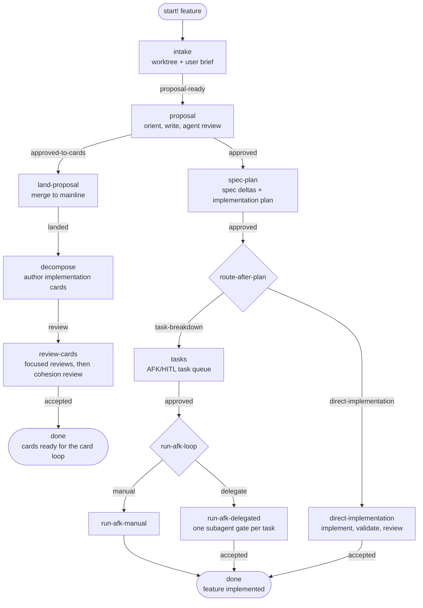
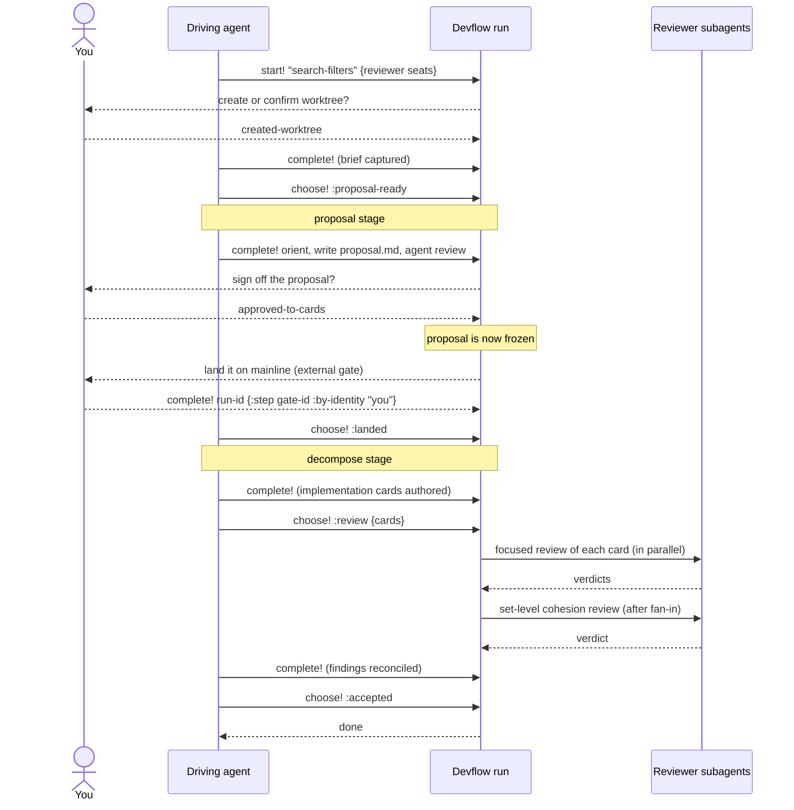
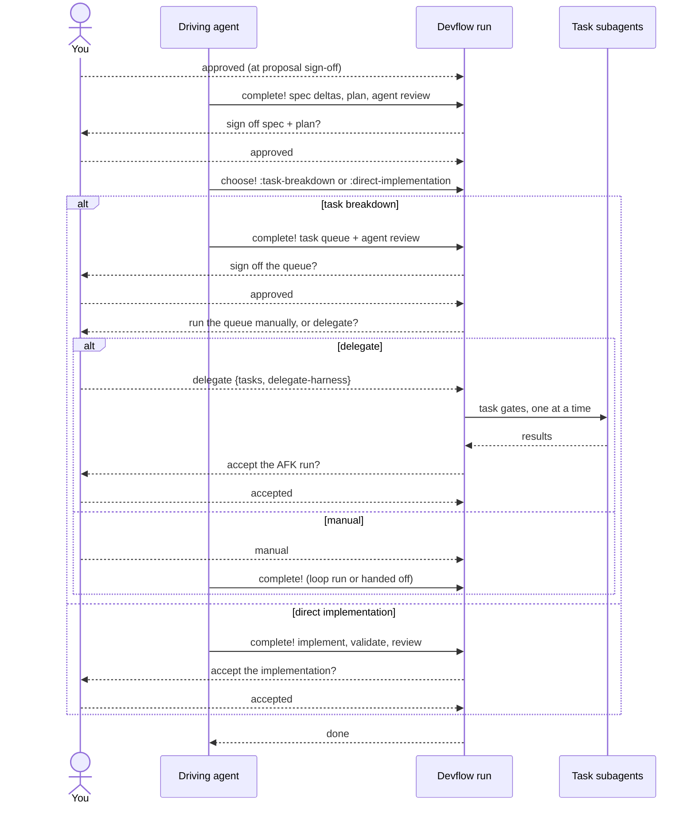
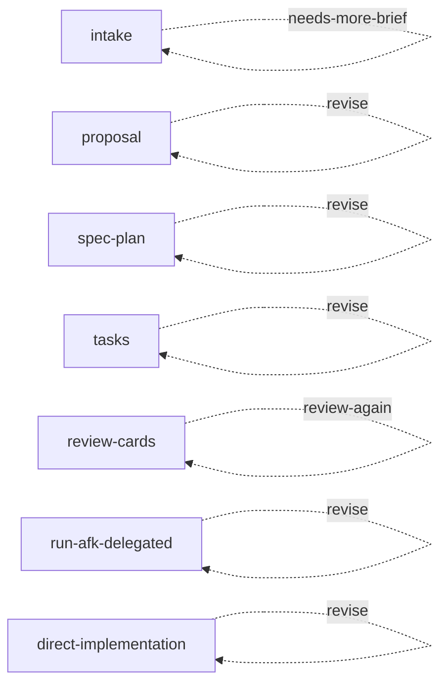

# Devflow

A feature-delivery lifecycle, built as [Millhouse workflows](https://github.com/codethread/millhouse.spool/tree/f80b80c8697e48a6ce56344372a32136d2bf279c/spools/workflow). You name a feature; each stage hands you the next step or the next decision.

```sh
strand workflow start search-filters --workflow intake \
  --params '{"feature":"search-filters"}'
# => {"ready":[{"role":"checkpoint","checkpoint":"create-or-confirm-worktree",
#                "choices":["created-worktree","already-in-worktree","abort"]}],
#     "done":false}
```

**The feature name is the handle.** It *is* the `workflow/run-id`, so there is no separate run handle to keep. Devflow owns static workflow definitions; Millstrand's generic workflow API owns execution.

## Declaration and selection

Devflow's workflow, query, and operation Vars use Millstrand's three-form authoring convention. The unbanged form defines an inert declaration, the typed `use-<kind>!` form selects an existing declaration for the current module, and the bang form defines and selects in one expression.

The root module uses explicit `use-workflow!`, `use-query!`, and `use-op!` forms to publish its complete catalogue. A consumer that requires `ct.spools.devflow` from its own module can select only the declarations it needs, for example:

```clojure
(require '[ct.spools.devflow :as devflow]
         '[ct.spools.devflow.planning :as planning]
         '[millhouse.spools.workflow :as workflow]
         '[millstrand.api.millstrand.alpha :as millstrand])

(workflow/use-workflow! planning/intake planning/proposal)
(millstrand/use-query! devflow/devflow-ready)
(millstrand/use-op! devflow/devflow)
```

Selection is the publication boundary. Loading the namespace or evaluating a definition outside module collection does not publish it.

| You have | You call |
|---|---|
| A step to do | `strand workflow complete <feature>` |
| A decision to make | `strand workflow choose <feature> <choice> --input '<json>'` |
| Either, and you don't want to care which | `strand workflow next <feature> [--choice <choice>]` |

## What devflow leaves behind

> **Code tells you *what*. Devflow docs tell you *why*.**

The run is scaffolding. The output is a documentation trail that lives in the
repo alongside the code it explains.

```
devflow/
|-- README.md
|-- rfcs/YYYY-MM-DD-<slug>.md
|-- specs/<spec-name>.md              <- canonical: how the system behaves
|-- feat/<feature>/
|   |-- proposal.md                   <- why, agreed before any code
|   |-- specs/<spec-name>.delta.md    <- how this feature changes the above
|   `-- <feature>.plan.md
`-- archive/yy-mm-dd__<feature>/      <- every past feature, proposals and deltas
```

The task queue is deliberately absent from the tree: tasks and implementation cards live wherever the workspace's decomposition target puts them. The shipped default authors them as **strands in the Millstrand graph** (`strand ready --query devflow-tasks`), and a workspace may bind its own target instead — see [Plugging in your own decomposition](#plugging-in-your-own-decomposition).

**`proposal.md` — plan mode, written down.** It comes before any code, and the
stage stops for human sign-off. That gap is the point: time to consider the
framing and align with the agent while changing your mind is still cheap.
Approval freezes it, so it stays the record of what was actually agreed rather
than drifting into a summary of what got built.

**`specs/` + `<spec>.delta.md` — docs that travel with the code.**
`devflow/specs/` is canonical: it states the system's observable behaviours.
Every feature must say how it changes them, as a delta file beside its proposal —
so a proposed behaviour change is reviewable *as a diff against the current
contract*, not buried in prose. When the feature completes, its deltas merge into
the canonical specs. The docs can't fall behind the code, because updating them
is how a feature finishes.

**`archive/` — every feature that came before**, with its proposal, deltas, and
implemented RFCs intact. Historical context, explicitly not current truth: it
tells you why the current specs say what they say.

**Stable IDs, everywhere.** Every document and every point inside it carries a
grepable id — `PROP-Sfl-001`, `PLAN-Sfl-001.P1`, `SPEC-Sfl-002@3`. Prefixes are
`RFC`, `PROP`, `SPEC`, `DELTA`, `PLAN`, `TASK`; nested ids are prefixed with
their document's full id, so they never clash. You can point an agent at
`PLAN-Sfl-001.P3` in chat and it lands on exactly one paragraph — and the same
search still finds it in the archive years later.

The rules for writing each of these ship with the spool as markdown guides —
see [authoring guidance](#authoring-guidance).

## The lifecycle



Each stage is its own workflow definition. Choosing a routed option closes the
current stage and opens the next one under the same feature name, so a run is a
chain of small, inspectable stages rather than one giant graph.

| Stage | What happens | Who decides the exit |
|---|---|---|
| `intake` | Confirm you're in a feature worktree, capture the user's brief, agree the scope is clear enough to propose | you, then the agent |
| `proposal` | Read the surrounding RFCs/specs/code, write `proposal.md`, run an agent review | **you** |
| `land-proposal` | Wait for the approved proposal to be merged to mainline, then confirm it landed | whoever merges, then the agent |
| `decompose` | Author self-contained implementation cards from the merged proposal, through the pluggable card-authoring defer | the agent |
| `review-cards` | Review every card in parallel, then the set as a whole, then reconcile findings | the agent |
| `spec-plan` | Write spec deltas and the implementation plan, run an agent review | **you** |
| `route-after-plan` | Decide: task queue, or implement directly | the agent |
| `tasks` | Author the AFK/HITL task queue through the pluggable task-authoring defer, run an agent review | **you** |
| `run-afk-loop` | Decide: run the queue yourself, or delegate it to subagents | **you** |
| `run-afk-manual` | Run or hand off the AFK loop in this worker | — (closes the run) |
| `run-afk-delegated` | One sequential subagent per approved task, then accept the result | **you** |
| `direct-implementation` | Implement, validate, review, accept | **you** |
| `abort` | Record why the feature stopped | — (closes the run) |

## Which route should I take?

Proposal sign-off is the fork. **Prefer `approved-to-cards`.**

**`approved-to-cards` — the cards route.** Devflow's job ends at *"the approved
proposal is merged on mainline and the implementation cards are authored and
reviewed."* Implementation then belongs to your card loop, where each card is
worked cold by its own agent. This is the right shape when the work is bigger
than one session's context.

**`approved` — the single-run route.** Spec deltas, plan, task queue, and
implementation all happen inside this one run. Take this when the feature
genuinely wants its implementation driven here — small, settled, one sitting.

Both routes are fully supported. Reach for the single-run route deliberately;
otherwise take the cards route.

### Headless agent gates

Devflow publishes delegated work as Workflow `:agent` gates. A workspace
activates the Harnesses `:agent` executor after its shared alias catalog and
repository reviewer policy. Inspect available seats and review declarations
with `strand agent list` and `strand agent reviewers`; inspect a run with
`strand agent show <run-id>`, and wait for provider settlement with:

```sh
strand await --query agent-run-settled --param run-id=<run-id> --min-count 1
```

Work-target assignments use `strand agent assign <agent> --task <id> --cwd <worktree>`.
Assignment accepts a ready run but does not create a worktree or
claim the target, and blocked targets wait for their `depends-on` prerequisites.
The gate adapter uses `harness/alias`, `harness/prompt`, and optional
`harness/cwd`; completed output is copied back as `harness/result`.

### The cards route, end to end



Two things to know about the reviews:

- **Focused reviews judge one card each** — its cold-work contract: evidence of
  current state, target outcome, constraints, proposal traceability, done-when,
  validation gates, and whether it can land independently.
- **The set-level review judges only the connections** — coverage, gaps and
  overlaps, slicing, dependency edges, integration seams. It starts only after
  every focused review closes, and deliberately does not repeat their work.

How cards are grouped is your workspace's own convention, not devflow's: if a
grouping card (an epic, a parent strand) should be reviewed, include its ref in
the set like any other card.

If reconciling findings changed a card materially, choose `:review-again` with
the *current* full card set and the next round fans out over that.

The cards route needs two reviewer seats, supplied as start params so your
workspace config picks the harnesses:

```sh
strand workflow start search-filters --workflow intake --params \
  '{"feature":"search-filters","card-reviewer":"pi-low-ro",\
    "card-set-reviewer":"opus-strong-ro","review-cwd":"/path/to/worktree"}'

;; ... approve to cards, land the proposal, author the cards ...

strand workflow choose search-filters review --input \
  '{"cards":[{"id":"card-43","title":"Filter query contract"},\
             {"id":"card-44","title":"Filter result UI"}]}'
;; => {:ready [{:gate "agent" :title "Focused review of card card-43: ..."}
;;             {:gate "agent" :title "Focused review of card card-44: ..."}]
;;     :done false}
```

Both seats are validated at `:approved-to-cards`, *before* the merge gate opens —
missing review policy can't surface only after you've merged something. Card ids
must be distinct and token-safe (`[A-Za-z0-9][A-Za-z0-9._-]*`) because they
become step ids.

### The single-run route



Delegating the queue is opt-in. Approve the task graph first (no inline queue
is required). At the execution choice, supply the **complete approved queue**
and harness assignments as Delegate's required input:

```sh
strand workflow choose search-filters delegate --input \
  '{"tasks":[{"id":"impl","title":"Implement filters","body":"Use the signed-off plan."},\
              {"id":"tests","title":"Add regression tests"}],\
    "delegate-harness":"pi-main","delegate-cwd":"/path/to/feature/worktree"}'
;; => {:ready [{:gate "agent" :title "Delegate AFK task impl for search-filters" ...}]
;;     :done false}
```

`workflow choices` exposes this contract at the decision that needs it. Missing
queues, duplicate/unsafe ids and unresolved harness assignments fail before the
checkpoint changes or any task gate is poured. Supply the complete queue again
at this choice even if it was provided earlier; it must match the user's approved
task graph, not a newly invented plan.

Task and card-ref maps use keyword keys in Clojure (`:id`, `:title`, etc.).
The workflow CLI recursively converts JSON object keys to keywords. Direct
string-keyed or mixed-keyed maps are rejected, rather than silently producing
positional loop ids. Ids must be token-safe and distinct — they become step ids. Every
task must resolve a harness, either its own `:harness` or the stage's
`:delegate-harness`. An optional `:delegate-preamble` is prepended to each task
prompt verbatim; devflow adds no policy of its own.

Choosing `:manual` needs no inline task data — the task graph remains the progress
owner. Its single step records `devflow/afk-outcome`: queue reference, outcome
(`exhausted`, `blocked`, `failed` or `handed-off`), completed/remaining task ids,
validation evidence and the next owner. Handoffs also record the exact accepting
run/target. Closing this workflow records that outcome, not feature delivery.

## External receipts and resumption

- Both intake worktree choices require `repository`, absolute `worktree` and
  `branch`. The choice stores `workflow/outcome-input` on its checkpoint.
  Capture-brief reads that exact receipt, verifies cwd, and copies it into
  `--context` on completion so revisions and continuations retain it.
- The external proposal gate records `devflow/merge-receipt` with repository,
  mainline, merged revision, proposal path and external merge evidence. The
  following `landed` choice requires those fields after verification. A closed
  gate or a supplied actor label is not evidence of merge or human approval.
- Card authors complete with `devflow/review-set`, the exact nonempty vector of
  `{id, title}` refs. The parent handoff reads that closed-step receipt before
  passing it to the scoped reviews. The Kanban adapter additionally records
  draft, epic and publication receipts; see its README for interruption handling.

Read receipts through `strand subgraph <root-id>` and `strand show <step-id>`.
Arbitrary receipt attributes are not projected in `workflow ready`. Ordinary
instructions are frozen at pour: `complete --context` stores data but does not
rewrite later prompts. Choice specs validate receipt shape, not external facts;
ordinary completion attributes remain driver-owned obligations, not a new
engine-enforced output schema. Verify the named external result before closing.

## Plugging in your own decomposition

Both decomposition points — the tasks stage's queue authoring and the
decompose stage's card authoring — are `workflow/defer` steps: named selection
points whose target a worker picks at run time from a bound allowlist. The
ready step advertises its allowlist in `workflow/defer-workflows`, and you
fill it with the generic verb:

```sh
strand workflow defer search-filters --workflow author-task-strands \
  --params '{"feature":"search-filters"}'
```

Defer targets receive **only** the params passed at the fill — run context
never crosses the boundary. Task targets need the feature explicitly. Both
shipped card targets additionally require the verified landing receipt:
`repository`, `mainline`, `merged-revision`, `proposal-path`, `merge-evidence`.
Read it from the decompose root's `workflow/context`, then pass those exact
values in `--params` alongside `feature`; the feature-only example above is
for task authoring, not card authoring.

Devflow binds exactly one target per point, and both author **strands**:

| Defer | Stage | Shipped target |
|---|---|---|
| `:author-tasks` | `tasks` | `author-task-strands` — tasks as strands (`devflow/task-type`, `devflow/feature`, `depends-on` edges; see `strand devflow guidance tasks`) |
| `:author-cards` | `decompose` | `author-card-strands` — cards as strands whose bodies carry the cold-card contract (see `strand devflow guidance decompose`) |

Devflow deliberately ships no binding to any external system. This repository
does ship one worked binding as its own separate root — `codethread/devflow-kanban-adapter`
(see `kanban-adapter/README.md`), which carries the dependency devflow itself
refuses to take. To decompose into GitHub issues, Jira tickets, or anything
else, bind the published **unbound templates** (`tasks-open`, `decompose-open`)
yourself from trusted Clojure that can see both spools:

```clojure
(require '[millhouse.spools.workflow :as workflow]
         '[ct.spools.devflow.execution :as execution])

;; 1. Register your own :call-entrypoint authoring workflow.
(workflow/register-workflow! :jira-tasks 'my.spool/jira-tasks)

;; 2. Bind the template with your target beside (or instead of) the default.
(workflow/defworkflow my-tasks
  "Task breakdown offering the strand-native default and Jira."
  {:entrypoints #{:continue :call}
   :param-spec :my.spool/tasks-params
   :defaults {:revision false}}
  (workflow/bind-defers execution/tasks-open
                        {:author-tasks #{:author-task-strands :jira-tasks}}))

;; 3. Re-point the routed stage name at your definition.
(workflow/register-workflow! :tasks 'my.ns/my-tasks)
```

Registered-name routes resolve at `choose!` time, so re-pointing `:tasks` (or
`:decompose`) redirects even in-flight runs at their next transition. A target
must declare the `:call` entrypoint — it pours beneath the current stage root
and returns into it, so review and human sign-off stay in devflow whatever
system authored the breakdown.

## Revising

Every human sign-off offers `:revise`, intake's scope discussion offers
`:needs-more-brief`, and card review offers `:review-again`. All of them re-run
the stage under the same feature name, carrying your original start params
forward.



Two stages skip work they've already done, so a revision round starts where it
matters:

- **intake** skips the worktree checkpoint — the worktree already exists, so the
  round is ready at "capture brief".
- **proposal** skips orientation — you already read the surrounding context, so
  the round is ready at "write proposal".

The other stages re-run in full. `:review-again` requires the current card
refs, so a reconciliation that added or removed cards replaces the next
round's fan-out.

**Revision is stage-local.** Approving after a revise never leaks "this is a
revision" into the next stage.

### The proposal freezes at approval

Revision rounds are the proposal document's **only** editing window. `:approved`
and `:approved-to-cards` both mark it Approved and stop the edits: no later stage
reopens it.

Implementation is free to diverge from it — the spec deltas, the plan, and the
code carry what is true *now*, and the plan records why scope moved. Keeping an
approved proposal in sync with the build would hide the intent everyone actually
agreed to behind a document that merely looks current, and cost a round of
busywork per change to do it.

## Aborting

Every human decision point can abort, plus the three agent checkpoints where a
feature can genuinely become undeliverable: `:confirm-proposal-landed` (the
proposal won't land), `:handoff-card-review` (no reviewable card set could be
authored), and `:card-review-verdict` (the decomposition can't be made
reviewable). Intake's scope discussion and the post-plan route choice have no
abort — neither is a place where stopping is the answer.

Abort always requires a reason, and `choose!` fails before mutating anything if
you omit it:

```clojure
strand workflow choose search-filters abort --input \
  '{"reason":"Superseded by the unified query work"}'
```

The reason is recorded on the abort step, which then closes the run.

## Authoring guidance

Devflow doesn't just tell you to write a proposal — it ships the rules for
writing one, as markdown guides bundled with the spool. Any step that authors a
document advertises its guide key in the `devflow/guide` strand attribute; the
guide itself is resolved live from the loaded spool, never from run state.

```sh
strand devflow guidance           # workspace overview: layout, paths, invariants, ID scheme
strand devflow guidance proposal  # one artifact's full authoring guide
```

From trusted Clojure the same knowledge is `(devflow/guidance)` /
`(devflow/guidance :proposal)`. Every guide is one markdown document covering
the same ground in order: purpose, artifacts, prerequisites, guide-specific
knowledge, procedures, constraints, a validation checklist, templates, and
related guides.

| Guide | For |
|---|---|
| `proposal` | Feature-local problem framing; frozen at sign-off as the agreed intent |
| `rfc` | Pre-feature decision record: options, tradeoffs, recommendation, outcome |
| `spec` | Stable system boundaries — root specs, feature specs, and deltas |
| `plan` | The reviewable build strategy between framing and task slicing |
| `tasks` | A deterministic AFK queue of tracer-bullet vertical slices |
| `afk` | Running that queue unattended until it's exhausted, blocked, or failing |
| `decompose` | Turning a merged proposal into cards a cold agent can work |
| `finish-archive` | Closing out a shipped or abandoned feature |

`rfc` and `finish-archive` have no stage step of their own. RFCs get written on
demand when intake or proposal work exposes real uncertainty; finish/archive is
the workspace-side procedure you follow after `squash-run!`.

The overview also carries the workspace invariants and the ID convention:
which document owns what, which are writable when, and how to allocate the next
id without clashing with the archive.

The guide sources live under `resources/ct/spools/devflow/guidance/` as plain
markdown — one file per guide plus the document templates — with a small
placeholder pass (`{{template:...}}`, `{{ownership-table:...}}`, ...) so shared
rules are stated once.

## Finishing a run

From trusted Clojure (the generic worker CLI deliberately has no squash verb):

```clojure
(require '[millhouse.spools.workflow :as workflow])

(workflow/squash-run! "search-filters")
```

Squashes a finished run into one closed digest strand. It fails loudly while any
stage is still active. This closes out the *graph* only — spec promotion, plan
status, and moving the feature folder into `devflow/archive/` are the workspace
side, described by `strand devflow guidance finish-archive`.

---

## Reference

### Commands

Devflow adds no run-driving façade. Use Millstrand's generic workflow surface; devflow's own `devflow` op serves static authoring knowledge only:

| Need | Command |
|---|---|
| Discover definitions | `strand workflow list`, then `strand workflow show intake` |
| Start the lifecycle | `strand workflow start <feature> --workflow intake --params '<json>'` |
| Inspect a feature | `strand workflow ready <feature>` or `strand workflow choices <feature>` |
| Advance it | `strand workflow complete`, `choose`, or `next` |
| Fill a decomposition defer | `strand workflow defer <feature> --workflow <target> --params '<json>'` |
| Work the strand-native queue | `strand ready --query devflow-tasks` |
| Read authoring guidance | `strand devflow guidance [<guide>]` |
| Read history / archive | trusted Clojure: `workflow/run-history`, `workflow/squash-run!` |

The generic workflow functions own the equivalent Clojure API. Devflow's one
static helper is `(devflow/guidance)`, the Clojure twin of
`strand devflow guidance`.

### Resume discovery

Devflow publishes three named queries with the module:

| Query | Command | Result |
|---|---|---|
| `devflow-runs` | `strand list --query devflow-runs` | Active lifecycle roots that can be resumed. |
| `devflow-ready` | `strand ready --query devflow-ready` | Ready work beneath active Devflow roots. |
| `devflow-tasks` | `strand ready --query devflow-tasks` | Runnable strand-native tasks and cards (`list` serves the whole open queue). |

The ready query follows `parent-of` edges from a Devflow root, because
`workflow/family` belongs to the root rather than each step.

### Start parameters

Supplied to `strand workflow start … --params` and carried in context for the
whole run, surviving every revision loop.

| Param | Default | Meaning |
|---|---|---|
| `:worktree-check` | `"required"` | `"already-in-worktree-ok"` when the agent is already running inside the feature worktree |
| `:card-reviewer` | — | Harness alias for focused card reviews (required by the cards route) |
| `:card-set-reviewer` | — | Harness alias for the set-level cohesion review (required by the cards route) |
| `:review-cwd` | — | Working directory for review subagents |

Each stage declares a `:param-spec` over the whole map, and every checkpoint
choice that takes input declares its own contract — so generic `workflow choose`
rejects a bad input map before it routes.

### Stage definitions

Devflow registers sixteen named workflow definitions: `intake`, `proposal`,
`land-proposal`, `decompose`, `review-cards`, `spec-plan`, `route-after-plan`,
`tasks`, `run-afk-loop`, `run-afk-manual`, `run-afk-delegated`,
`direct-implementation`, `agent-review`, `author-task-strands`,
`author-card-strands`, and `abort`.

`intake` is the sole `:start` definition. `agent-review`,
`author-task-strands`, and `author-card-strands` are call-only procedures —
the last two are the shipped defer targets; the remaining stages are
continuations that can also be called. The unbound templates `execution/tasks-open` and
`devflow/decompose-open` are published Vars, not registered definitions.

The root module still publishes the same sixteen registered names. Clojure
callers select declarations from coherent namespaces: `ct.spools.devflow.planning`
(intake/proposal/landing), `ct.spools.devflow.execution` (spec-plan, route, tasks
and implementation), and `ct.spools.devflow.cards` (review-cards). The remaining
declarations and root selection live in `ct.spools.devflow`. Named boundary specs
live in `ct.spools.devflow.internal.definition`; inspect the registered definition
or choice contract instead of assuming a spec keyword from the workflow name.
Inspect them through the live generic registry:

```sh
strand workflow list
strand workflow list --entrypoint continue
strand workflow show review-cards
```

### Strand attributes

What devflow writes on the graph, if you're building tooling over it.

| Attribute | Meaning |
|---|---|
| `workflow/family` | `"devflow"` on every devflow stage root |
| `devflow/stage` | `"intake"`, `"proposal"`, `"land-proposal"`, `"decompose"`, `"card-review"`, `"spec-plan"`, `"route-after-plan"`, `"tasks"`, `"afk"`, `"implementation"`, `"abort"` |
| `devflow/feature` | The feature name; the roster spool reads its presence to report `roster/engine "devflow"` |
| `devflow/guide` | The authoring guide key for this step |
| `devflow/task` | The approved AFK task id a delegated gate is running |
| `devflow/task-type` | `"afk"` or `"hitl"` on a strand-native task or card; written by agents following the tasks guide, and what the `devflow-tasks` query matches |
| `hitl` | `"true"` on a HITL task strand; the batteries convention treats a ready strand carrying it as stop-and-ask |
| `devflow/tasks-root` | `"true"` on the optional per-feature task-root strand |
| `devflow/review` | `"agent"` on agent review work |
| `devflow/review-scope` | `"card"` or `"card-set"` on card-review gates |
| `devflow/card` | The card id a review gate judges |
| `devflow/worktree-check` | On the intake root, from `:worktree-check` |
| `workflow/artifact` | What a step produces: `"brief"`, `"proposal.md"`, `"specs/*.delta.md"`, `"<feature>.plan.md"`, `"task strands"`, `"implementation cards"` |
| `workflow/decision-point` | What a checkpoint decides, e.g. `"proposal-signed-off"` |
| `workflow/action-ref` | The action/skill an agent should invoke, e.g. `"devflow.proposal.orient"` |
| `workflow/gate` | `"agent"` on delegated AFK and card-review gates; `"human"` on the proposal merge gate |
| `workflow/instruction` | Freeform guidance surfaced in the step view |
| `harness/alias`, `harness/prompt`, `harness/cwd` | Alias, prompt, and optional working directory passed to the headless agent executor |
| `harness/result` | Result copied from a completed headless agent run onto its workflow gate |

Every Devflow root carries a known `devflow/stage`; use the root attributes when
building a projection that needs the current stage. The generic step view remains
engine-owned.

The proposal merge gate is repo-agnostic: any mainline merge process counts, and
generic `workflow complete` records landing provenance via `--by-identity`.
This is attribution, not authenticated authorization.

`(devflow/dependency-sentinel)` returns `"devflow-spool"` through this spool's
declared Maven dependency, so runtime validation can observe that approved spool
dependencies resolved.

### See also

- [README.md](./README.md) — installation and activation.
- [Millhouse workflow](https://github.com/codethread/millhouse.spool/tree/f80b80c8697e48a6ce56344372a32136d2bf279c/spools/workflow) — the engine underneath: run lifecycle, checkpoints and routing, gates, molecule ops, and the full `workflow/*` vocabulary.
- `(millhouse.spools.workflow/explain topic)` — machine-readable builder contracts.
- [Writing shared spools](./docs/spools/writing-shared-spools.md) — the pinned Millstrand contract for publishing and CLI shape.
